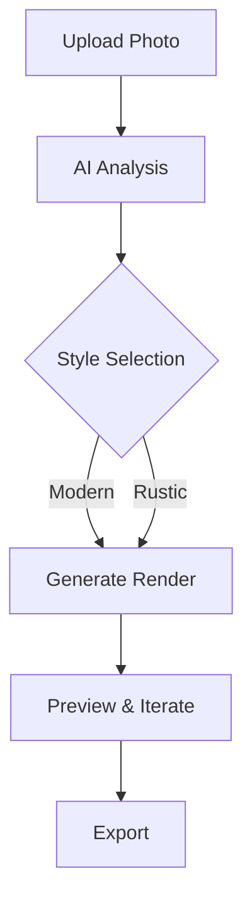

## Overview

RoomPivot transforms room photos into staged and redesigned visuals using AI. You upload any room image, select styles, and generate professional renders in seconds. Key concepts include AI-driven redesigns, iterative customization, industry applications, and versatile sharing options.

<Columns cols={3}>
  <Card title="AI Staging" icon="zap" href="/docs/staging">
    Instantly stage empty rooms with furniture and decor matching your style.
  </Card>
  <Card title="Redesign Styles" icon="palette" href="/docs/styles">
    Apply themes like modern, rustic, or minimalist to any space.
  </Card>
  <Card title="Iteration Tools" icon="edit-3" href="/docs/iteration">
    Refine designs with targeted adjustments and previews.
  </Card>
</Columns>

## AI-Powered Staging and Redesign

RoomPivot's AI analyzes uploaded photos to understand room layout, lighting, and dimensions. It then applies staging or redesign styles seamlessly.



<Callout kind="tip">
  Start with high-resolution photos (`>1024x768` pixels) for optimal AI results.
</Callout>

## Customization and Iteration Tools

Customize outputs through an intuitive interface. Follow these steps to iterate designs.

<Steps>
  <Step title="Select Base Style" icon="palette">
    Choose from 20+ predefined styles or upload custom references.
  </Step>
  <Step title="Adjust Elements" icon="sliders">
    Modify furniture, colors, and lighting with sliders.
  </Step>
  <Step title="Preview Changes" icon="eye">
    View real-time renders and compare versions side-by-side.
  </Step>
  <Step title="Save Iteration" icon="save">
    Export variants for client feedback.
  </Step>
</Steps>

## Applications in Real Estate and Design

Tailor RoomPivot to your workflow.

<Tabs>
  <Tab title="Real Estate" icon="home">
    Stage vacant properties to attract buyers. Generate before-and-after visuals for listings.

    <Expandable title="Pro Tips" default-open="false">
      Use neutral styles for broad appeal. Share high-res PNGs directly to MLS platforms.
    </Expandable>
  </Tab>
  <Tab title="Interior Design" icon="tool">
    Prototype client visions quickly. Iterate on mood boards without physical mocks.

    | Feature | Benefit |
    |---------|---------|
    | Color Swatches | Test palettes instantly |
    | Furniture Library | 10k+ items across styles |
    | Lighting Presets | Simulate day/night views |
  </Tab>
</Tabs>

## Output Formats and Sharing

Export in multiple formats and integrate via SDK.

<CodeGroup tabs="JavaScript,Python">
  ```javascript
  import { RoomPivot } from '@roompivot/sdk';

  const rp = new RoomPivot('YOUR_API_KEY');
  const result = await rp.redesign({
    image: 'room.jpg',
    style: 'modern'
  });
  console.log(result.url); // https://cdn.roompivot.com/render/abc123.png
  ```
  ```python
  from roompivot import RoomPivot

  rp = RoomPivot(api_key='YOUR_API_KEY')
  result = rp.redesign(image='room.jpg', style='modern')
  print(result['url'])  # https://cdn.roompivot.com/render/abc123.png
  ```
</CodeGroup>

Share via links or embeds. All outputs include metadata for tracking views.