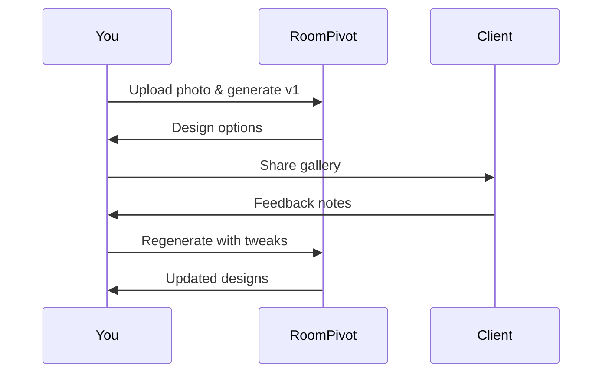

## Optimizing Photo Uploads

Upload high-quality photos to achieve the best AI-generated redesigns. Use well-lit images with minimal obstructions for accurate room detection and transformation.

<Callout kind="tip">
Capture photos from multiple angles during walkthroughs. Aim for natural lighting between 10 AM and 4 PM to avoid harsh shadows.
</Callout>

<Steps>
  <Step title="Prepare the Room" icon="camera">
    Clear clutter and ensure even lighting. Shoot at eye level for natural perspectives.
  </Step>
  <Step title="Choose Resolution" icon="maximize">
    Select images at least 1024x768 pixels. Higher resolutions yield finer details in redesigns.
  </Step>
  <Step title="Upload and Generate" icon="upload">
    Drag and drop into RoomPivot dashboard. Select style presets like "Modern Minimalist" for quick iterations.
  </Step>
</Steps>

## Iterating Designs for Client Feedback

Present multiple redesign options to clients and refine based on their input. RoomPivot supports rapid iterations to align visions quickly.



<Expandable title="Advanced Iteration Workflow" default-open="false">
Use version history in the dashboard to track changes. Export PNGs or share secure links for client review without accounts.
</Expandable>

## Integrating with Real Estate Listings

Embed RoomPivot redesigns directly into MLS listings, Zillow pages, or your website to showcase "after" visuals alongside existing photos.

<CodeGroup tabs="HTML,JavaScript">
```html
<iframe 
  src="https://app.roompivot.com/embed/YOUR_PROJECT_ID" 
  width="100%" 
  height="500"
  frameborder="0">
</iframe>
```

```javascript
const embed = document.createElement('iframe');
embed.src = 'https://app.roompivot.com/embed/YOUR_PROJECT_ID';
embed.width = '100%';
embed.height = '500';
embed.frameBorder = '0';
document.getElementById('room-preview').appendChild(embed);
```
</CodeGroup>

<Callout kind="success">
Replace `YOUR_PROJECT_ID` with the shareable ID from your RoomPivot project dashboard.
</Callout>

## Renovation and Staging Scenarios

Tailor RoomPivot outputs for specific use cases. Compare scenarios below to select the right approach.

<Tabs>
  <Tab title="Pre-Sale Staging" icon="home">
    Focus on neutral, appealing styles. Generate 3-5 options: traditional, contemporary, Scandinavian.
    
    | Style       | Best For              | Prompt Tip                  |
    |-------------|-----------------------|-----------------------------|
    | Traditional | Family homes         | "Add warm woods, classic furniture" |
    | Contemporary| Urban condos         | "Sleek lines, metallic accents"    |
  </Tab>
  <Tab title="Renovation Planning" icon="settings">
    Emphasize structural changes like wall removal or kitchen islands. Use custom prompts for accuracy.
    
    Example prompt: "Open kitchen layout with quartz counters and pendant lights, farmhouse sink."
  </Tab>
  <Tab title="Client Demos" icon="users">
    Create side-by-side before/after sliders. Share via link for interactive walkthroughs on tablets.
  </Tab>
</Tabs>

<Columns cols={2}>
  <Card title="Real Estate Agents" icon="home" href="/guide/real-estate">
    Boost listing views by 40% with virtual staging.
  </Card>
  <Card title="Interior Designers" icon="palette" href="/guide/designers">
    Iterate concepts in seconds for client meetings.
  </Card>
  <Card title="Renovators" icon="hammer" href="/guide/renovators">
    Visualize costly changes without mockups.
  </Card>
  <Card title="Marketers" icon="trending-up" href="/guide/marketing">
    Create social media assets from one photo.
  </Card>
</Columns>