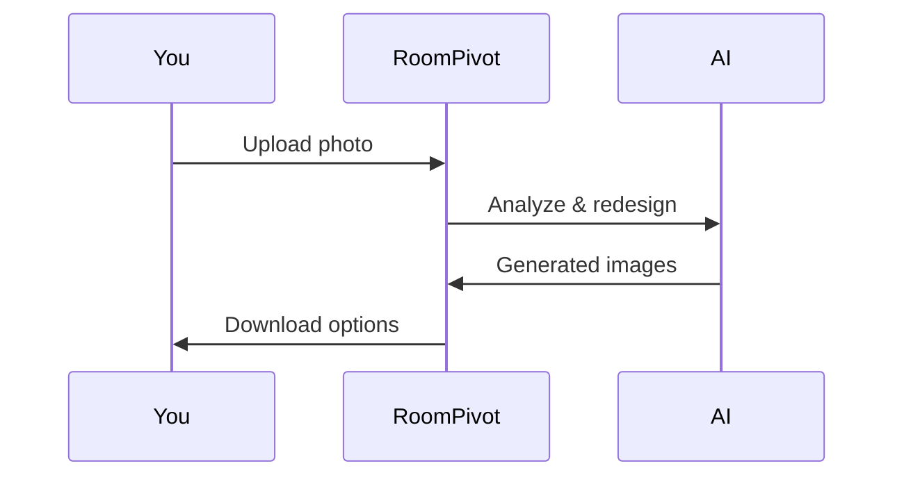

## Overview

RoomPivot leverages AI to stage and redesign rooms in seconds. You upload a photo of any space, and the tool instantly visualizes transformations like furniture placement, color schemes, and lighting adjustments. Professionals in real estate, interior design, and renovations use RoomPivot to showcase potential changes without physical staging costs.

This streamlines client presentations, property marketing, and design iterations. Generate multiple redesign options from one photo to demo ideas quickly.

## Key Benefits and Features

RoomPivot delivers speed, flexibility, and professional results. Explore the core advantages:

<Columns cols={3}>
  <Card title="Instant Transformations" icon="zap" href="/docs/quickstart">
    Upload a photo and receive redesigned versions in under 10 seconds. No manual editing required.
  </Card>
  <Card title="Cost Savings" icon="dollar-sign" href="/docs/pricing">
    Eliminate traditional staging expenses. Iterate designs digitally for free or low cost.
  </Card>
  <Card title="Multiple Styles" icon="palette" href="/docs/styles">
    Choose from modern, minimalist, rustic, or custom styles. Generate variants with one click.
  </Card>
</Columns>

<Callout kind="success">
  Professionals report 5x faster client approvals using RoomPivot visuals.
</Callout>

## Use Cases

Tailor RoomPivot to your workflow:

<Tabs>
  <Tab title="Real Estate" icon="home">
    Stage vacant properties for listings. Show "before and after" to attract buyers faster.
  </Tab>
  <Tab title="Interior Design" icon="palette">
    Prototype client visions. Export high-res images for proposals and mood boards.
  </Tab>
  <Tab title="Renovations" icon="hammer">
    Visualize updates like kitchen remodels or wall color changes before committing.
  </Tab>
</Tabs>

## How It Works

RoomPivot simplifies your design process:

<Steps>
  <Step title="Upload Photo" icon="upload">
    Select a room image from your device or URL.
  </Step>
  <Step title="Select Style" icon="wand-2">
    Pick a predefined style or describe your vision in natural language.
  </Step>
  <Step title="Generate & Share" icon="share-2">
    Receive redesigned images. Download or share directly with clients.
  </Step>
</Steps>



## Quick Start with API

Integrate RoomPivot into your apps:

<CodeGroup tabs="JavaScript,Python,cURL">
  ```javascript
  const formData = new FormData();
  formData.append('image', fileInput.files[0]);
  formData.append('style', 'modern');

  const response = await fetch('https://api.roompivot.com/v1/redesign', {
    method: 'POST',
    headers: { 'Authorization': `Bearer ${YOUR_API_KEY}` },
    body: formData
  });

  const result = await response.json();
  console.log(result.images); // Array of redesigned URLs
  ```
  ```python
  import requests

  files = {'image': open('room.jpg', 'rb')}
  data = {'style': 'modern'}
  headers = {'Authorization': f'Bearer {YOUR_API_KEY}'}

  response = requests.post('https://api.roompivot.com/v1/redesign', files=files, data=data, headers=headers)
  print(response.json()['images'])
  ```
  ```bash
  curl -X POST https://api.roompivot.com/v1/redesign \
    -H "Authorization: Bearer YOUR_API_KEY" \
    -F "image=@room.jpg" \
    -F "style=modern"
  ```
</CodeGroup>

<Expandable title="Frequently Asked Questions" default-open="false">
  ### What file formats work?
  RoomPivot supports JPEG, PNG, and WebP up to 10MB.

  ### Can I customize prompts?
  Yes, use the `prompt` parameter for detailed instructions like "add Scandinavian furniture".

  ### Is it secure?
  Images process on secure servers and delete after 24 hours.
</Expandable>

Start transforming spaces today—sign up for a free API key at [roompivot.com](https://roompivot.com).