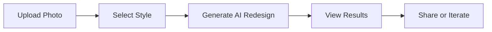

## Overview

Transform any room photo into a professionally staged space in seconds with RoomPivot. You upload an image, select a style, and generate redesigns powered by AI. This guide walks you through account creation, photo upload, redesign generation, and sharing results. Complete your first redesign in under 5 minutes.

<Callout kind="tip">
Prepare high-quality photos for best results: use well-lit rooms with minimal clutter and straight-on angles.
</Callout>

## Quickstart Steps

Follow these numbered steps to create your first redesign.

<Steps>
  <Step title="Create Account" icon="user-plus">
    Visit [app.roompivot.com](https://app.roompivot.com) and click **Sign Up**.

    Enter your email and create a password. Verify your email via the confirmation link sent to your inbox.

    <Tabs>
      <Tab title="Google" icon="chrome">
        Click **Continue with Google** for one-click signup.
      </Tab>
      <Tab title="Email" icon="mail">
        Use your work email for professional accounts.
      </Tab>
    </Tabs>
  </Step>

  <Step title="Upload Photo" icon="upload">
    Log in and click **New Project**.

    Drag and drop a room photo or browse your files. Supported formats: JPEG, PNG (max 10MB).

    ```bash
    # Example file prep (optional)
    convert room.jpg -resize 1024x1024 room-prepared.jpg
    ```

    <Callout kind="info">
      Crop photos to focus on the room interior for optimal AI detection.
    </Callout>
  </Step>

  <Step title="Generate Redesign" icon="zap">
    Select a style from presets like **Modern**, **Scandinavian**, or **Luxury**.

    Click **Generate**. Wait 10-30 seconds for AI processing.

    Customize with prompts: "Add plants and neutral tones".

    <CodeGroup tabs="Preset,Custom">
      ```json
      {
        "style": "modern-minimalist",
        "furniture": "sofa, coffee table"
      }
      ```
      ```json
      {
        "prompt": "Transform into cozy bohemian living room with warm lighting"
      }
      ```
    </CodeGroup>
  </Step>

  <Step title="View and Share" icon="share-2">
    Review side-by-side before/after views.

    Download PNG or share via link. Embed in presentations with this code:

    ```html
    
    ```

    Save to gallery or export as PDF for clients.
  </Step>
</Steps>



## Next Steps

Explore more features after your first redesign.

<Columns cols={3}>
  <Card title="Advanced Styles" icon="palette" href="/docs/styles">
    Unlock 50+ design themes and custom prompts.
  </Card>
  <Card title="Batch Processing" icon="layers" href="/docs/batch">
    Redesign multiple rooms at once.
  </Card>
  <Card title="API Integration" icon="code" href="/docs/api">
    Automate via our REST API.
  </Card>
</Columns>

<Expandable title="Troubleshooting Common Issues" default-open="false">
  - **Blurry results**: Use higher-resolution photos (`>1024px`).
  - **Slow generation**: Check internet; upgrade to Pro for priority.
  - **No account email**: Search spam folder or resend verification.
</Expandable>

Your first redesign is ready—start staging properties faster today!